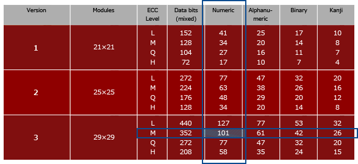
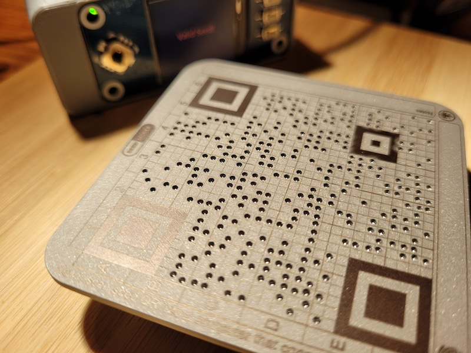
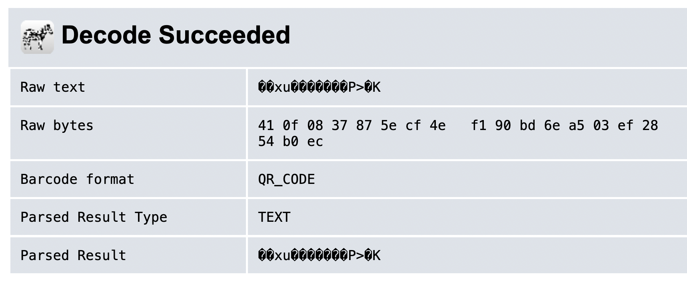

# KeyQr Format Specification

[Seedener](https://github.com/MaximEdogawa/seedener) is an open source, DIY, fully-airgapped Chia hardware wallet that wipes all private data from memory each time it's turned off. That means users need to re-enter their Chia private key each time they use it.

To speed up this key entry process we have defined a way to encode a private key as a QR code that can be instantly scanned into a Seedener or potentially any other Chia hardware wallet that has a camera.

The approach is specifically designed to encode the minimum possible amount of data in order to keep the resulting QR code small enough that it can be transcribed *by hand*. This sounds ridiculous at first, but remember that this is secret data that should never be stored in any digital medium. And even printers present some additional risk vectors.


We have defined two QR formats:
* Standard KeyQR

Specifications for each follow below, as well as discussion of the pros and cons of each format.


# "Standard" `KeyQR` Specification
We take the indices of the key phrase and concatenate them into one long stream of digits. Each index must be exactly four digits so shorter numbers must be zero-padded (`12` becomes `0012`).

Using the example above:

```bash
# with zero-padded indices:
1924 0222 0235 1743 0631 1124 0378 1770 0641 1980 1290 1210

# final assembled digit stream:
192402220235174306311124037817700641198012901210
```

This digit stream is then encoded into a QR code.


### QR Code Data Formats
It's important to note here that QR codes can encode data in a number of different ways:

<table align="center">
    <tr><td align="center"><br/><em><a href="https://www.qrcode.com/en/about/version.html">qrcode.com</a></em></td></tr>
</table>

QR codes are typically used to encode a website url, in which case the "Alphanumeric" format has to be used (the encoded data can consist of upper- and lowercase letters, numbers, and certain allowed symbols).

If you have a long url like `https://ohnoihavealongurl.com` (29 characters), the chart shows that it would not fit in a 21x21 QR code; its max capacity is 25 alphanumeric chars. But it's within the 47-char capacity of the 29x29 size.

### Bit efficiency matters
Notice that the "Numeric" column has greater capacity. This is because when you have fewer possible characters to encode, it takes less data to specify each one.

Alphanumeric format supports 44 possible characters. They are encoded as pairs, so that means there are 44^2 = 1,936 possible pairings to describe. Each pair can then be encoded using 11 bits:

```
2^11 = 2048
```

If you only used 10 bits, you could only specify 2^10 = 1,024 possible values; not nearly enough for the 1,936 possible pairings. 11 bits is the best this format can do.

The Numeric format is able to store 3 digits using just 10 bits. The largest possible 3-digit number is `999`, therefore 10 bits (2^10 = 1,024) is sufficient.

This is why a 25x25 QR code can only store 47 alphanumeric characters vs 77 numeric digits. It's the same amount of total data in terms of bits:

```
47 alphanumeric chars / 2 chars per pair * 11 bits per pair = 259 bits

77 numeric digits / 3 digits per group * 10 bits per group = 257 bits
```
*(both formats round up to 260 bits)*

Armed with this knowledge, we're ready to encode our KeyQR.

<table align="center">
    <tr><td></td></tr>
</table>

## Recoverability
If you lose your Seedener or somehow the project is abandoned or banned, how will you read back your KeyQR? 

With the Standard KeyQR format this is trivial--any smartphone can decode the numeric digit stream.

Tools like [zxing.org](https://zxing.org/w/decode.jspx) can help you get the binary data out as a hexidecimal string:



## Obfuscation
Conversely, having limited support for reading binary QR codes and the complications described above are seen by some as an added security feature.


# Some Additional Notes on QR Codes
Our main use case is to be able to quickly initialize a Seedener with your Chia private key. But using a QR code as your key loader--or even as your permanent backup etched in metal--has other advantages.

QR codes are ubiquitous now so plenty of hardware and software exists to read and generate them.

QR codes have built-in error correction. The "L" error correction mode is described as having a roughly 7% correction rate.

In general, QR codes are incredibly resilient to unreadable blocks. For example, you often see the middle blocks intentionally covered over with a logo:

<table align="center"><tr><td></td></tr></table>

This is right at the limit of Seedener's ability to read a KeyQR, despite the inaccessible blocks.

Similarly, QR codes can withstand human error during the manual transcription process. A few mis-coded blocks, a smeared ink blob, or other physical blemishes will generally not cause any problems.

